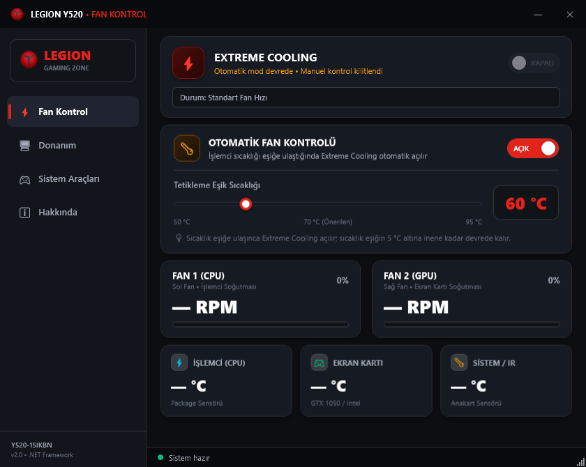
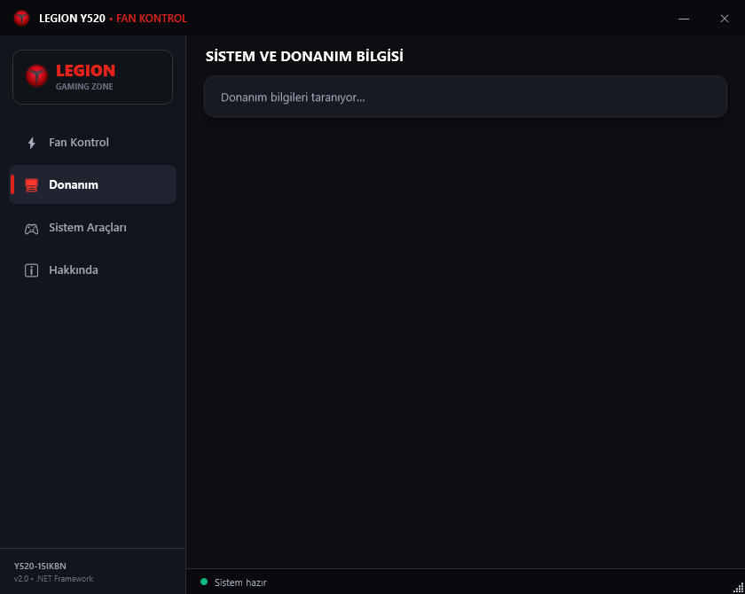
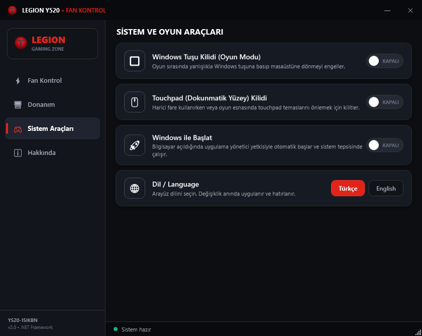
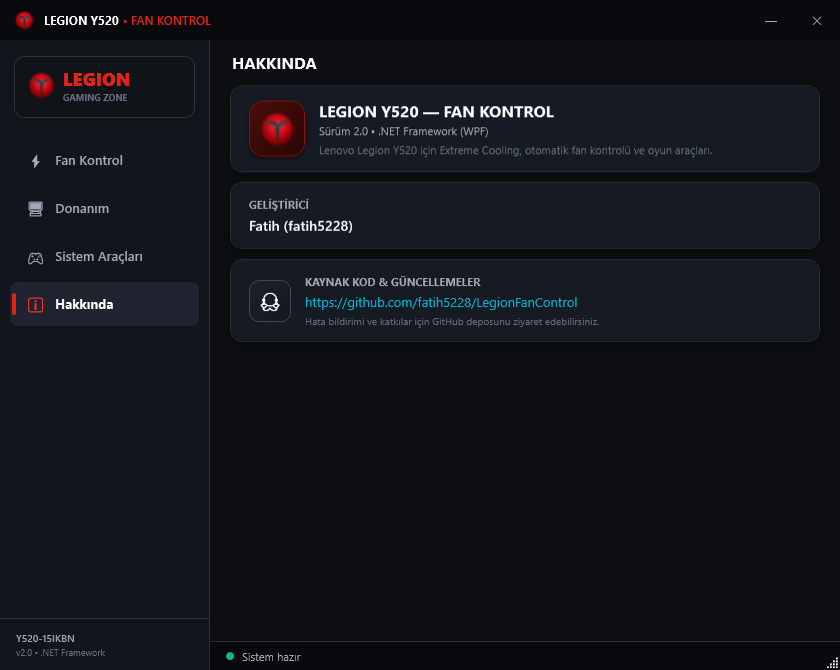

# Legion Y520 — Fan Kontrol / Fan Control

Lenovo Legion Y520-15IKBN (80WK) için sistem tepsili fan kontrol aracı.
Extreme Cooling, sıcaklık eşikli otomatik fan modu, donanım izleme ve oyun araçları.

A tray-based fan control tool for the Lenovo Legion Y520-15IKBN (80WK):
Extreme Cooling, temperature-threshold auto fan mode, hardware monitoring and gaming tools.



## Özellikler / Features

- ⚡ **Extreme Cooling** — tek tıkla fanları tam hıza çıkarır / max fan speed with one click
- 🌡 **Otomatik Mod** — CPU sıcaklığı eşiğe ulaşınca otomatik açılır, 5 °C histerezis ile kapanır / auto mode with adjustable threshold (50–95 °C) and 5 °C hysteresis
- 📊 **Canlı izleme** — Fan 1/Fan 2 RPM, CPU & GPU sıcaklığı (LibreHardwareMonitor), IR sıcaklığı / live RPM and temperatures
- 🎮 **Oyun araçları** — Windows tuşu ve touchpad kilidi / Windows key & touchpad lock
- 🚀 **Windows ile başlat** — Görev Zamanlayıcı üzerinden yönetici yetkisiyle otomatik başlatma / autostart via Task Scheduler
- 🌐 **Türkçe & İngilizce** arayüz, anında dil değişimi / bilingual UI with instant switching
- 🔔 Sistem tepsisinde çalışır / runs in the system tray

## Ekran Görüntüleri / Screenshots

| Donanım / Hardware | Sistem Araçları / System Tools | Hakkında / About |
|---|---|---|
|  |  |  |

## Kurulum / Installation

[Releases](https://github.com/fatih5228/LegionFanControl/releases) sayfasından:

- **LegionFanControl-Setup-v2.0.exe** — kurulum sihirbazı (önerilen) / installer (recommended)
- **LegionFanControl-v2.0.zip** — kurulumsuz taşınabilir sürüm / portable version

> Uygulama WMI ve donanım sensörlerine erişmek için yönetici yetkisi ister.
> The app requires administrator rights (WMI + hardware sensors).

## Kaynak Koddan Derleme / Building from Source

Visual Studio gerekmez; .NET Framework 4.x derleyicisi yeterlidir:

```bat
set FW=C:\Windows\Microsoft.NET\Framework64\v4.0.30319
%FW%\csc.exe -nologo -target:winexe -out:LegionFanControl.exe Program.cs Lang.cs ^
  -win32manifest:app.manifest -win32icon:app.ico ^
  -reference:System.Management.dll -reference:LibreHardwareMonitorLib.dll -reference:HidSharp.dll ^
  -reference:%FW%\netstandard.dll ^
  -reference:%FW%\WPF\WindowsBase.dll -reference:%FW%\WPF\PresentationCore.dll ^
  -reference:%FW%\WPF\PresentationFramework.dll -reference:%FW%\System.Xaml.dll
```

Kurulum paketi için / for the installer: [Inno Setup](https://jrsoftware.org/isdl.php) ile `kurulum.iss` derlenir.

## Kullanım / Usage

Ayrıntılı kullanım kılavuzu: [KULLANIM.txt](KULLANIM.txt)

## Bağımlılıklar / Dependencies

- [LibreHardwareMonitorLib](https://github.com/LibreHardwareMonitor/LibreHardwareMonitor) (MPL-2.0)
- [HidSharp](https://github.com/IntergatedCircuits/HidSharp) (Apache-2.0)
- System.Management (.NET)

## Lisans / License

MIT — ayrıntılar için [LICENSE](LICENSE) dosyasına bakın.
